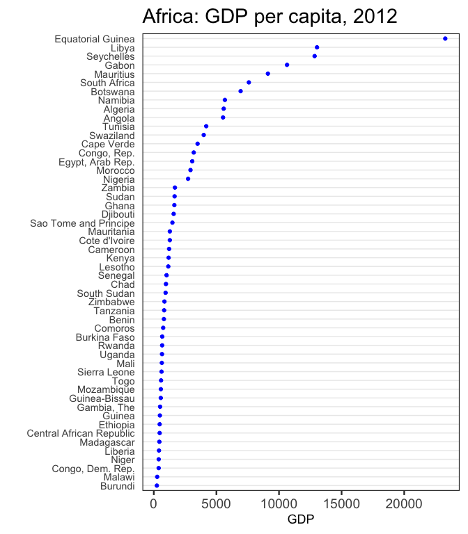
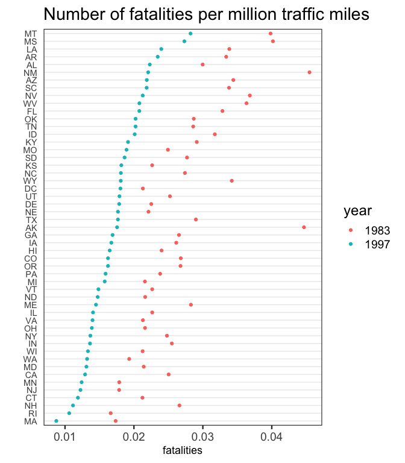
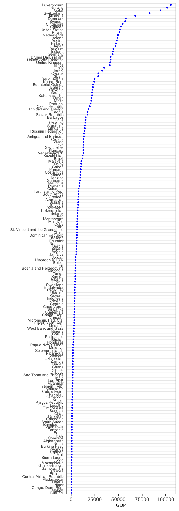

Cleveland Dot Plots
================
Joyce Robbins
January 9, 2019

``` r
## Cleveland Dot Plot theme
library(tidyverse)
theme_dotplot <- theme_bw(18) +
    theme(axis.text.y = element_text(size = rel(.75)),
          axis.ticks.y = element_blank(),
          axis.title.x = element_text(size = rel(.75)),
          panel.grid.major.x = element_blank(),
          panel.grid.major.y = element_line(size = 0.5),
          panel.grid.minor.x = element_blank())
```

``` r
world <-  read_csv("../data/countries2012.csv")
africa <- world %>% filter(CONTINENT == "Africa")
g <- ggplot(africa, aes(x = GDP, y = fct_reorder(COUNTRY, GDP))) +
    geom_point(color = "blue") + ylab("") +
    theme_dotplot + ggtitle("Africa: GDP per capita, 2012")
g
```



## Cleveland Dot Plot with Multiple Dots

``` r
library(AER)
data("USSeatBelts")
belts <- USSeatBelts %>% 
    filter(year %in% c(1983, 1997)) %>% 
    select(state, year, fatalities) 
 
ggplot(belts, aes(x = fatalities, 
                  y = fct_reorder2(state, year, -fatalities), 
                  color = year)) + 
    geom_point() + ylab("") + theme_dotplot + 
    ggtitle("Number of fatalities per million traffic miles")
```



## Large number of categories

Scroll

In chunk options: `{r fig.height
= 20}`


