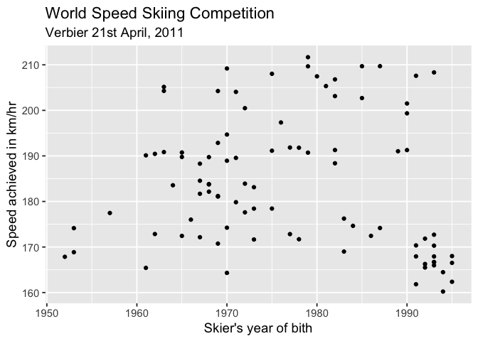
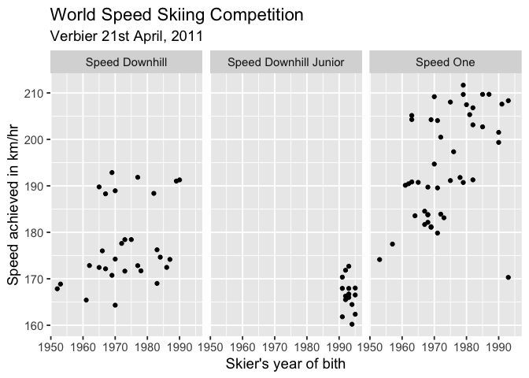
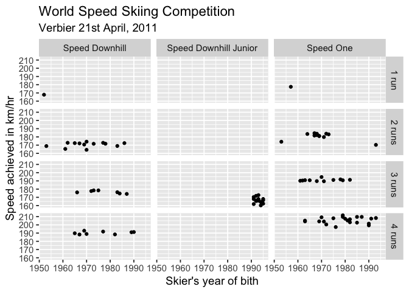
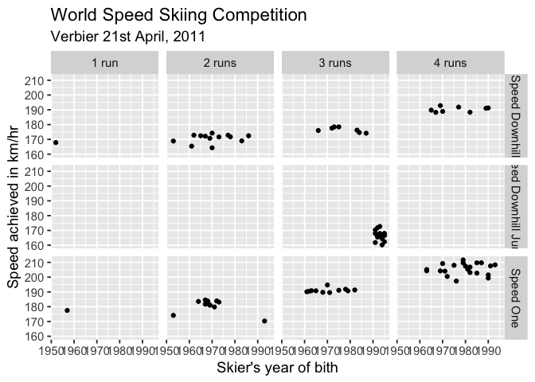

Facetting
================
Joyce Robbins
January 9, 2019

### Data

For these examples, we’ll use the `SpeedSki` dataset in the `GDAdata`
package:

``` r
library(GDAdata)
str(SpeedSki)
```

    ## 'data.frame':    91 obs. of  10 variables:
    ##  $ Rank      : int  1 2 3 4 5 6 7 8 9 10 ...
    ##  $ Bib       : int  61 59 66 57 69 75 67 58 62 56 ...
    ##  $ FIS.Code  : int  7039 7078 190130 7178 510089 7204 7053 7170 7230 7055 ...
    ##  $ Name      : Factor w/ 91 levels "ABRAHAMSSON Mats",..: 64 63 56 83 54 13 66 14 19 43 ...
    ##  $ Year      : int  1979 1987 1985 1979 1970 1993 1975 1991 1980 1982 ...
    ##  $ Nation    : Factor w/ 14 levels "AUT","BEL","CAN",..: 7 7 5 1 12 5 13 5 4 13 ...
    ##  $ Speed     : num  212 210 210 210 209 ...
    ##  $ Sex       : Factor w/ 2 levels "Female","Male": 2 2 2 2 2 2 2 2 2 2 ...
    ##  $ Event     : Factor w/ 3 levels "Speed Downhill",..: 3 3 3 3 3 3 3 3 3 3 ...
    ##  $ no.of.runs: int  4 4 4 4 4 4 4 4 4 4 ...

### Without facetting

A basic scatterplot of `Speed` vs `Year`:

``` r
library(ggplot2)
ggplot(SpeedSki, aes(Year, Speed)) +
  geom_point() +
  xlab("Skier's year of bith") +
  ylab("Speed achieved in km/hr") + 
  ggtitle("World Speed Skiing Competition",
          sub = "Verbier 21st April, 2011") +
  theme_grey(14)  # increases font sizes
```

<!-- -->

### Facet on `Event`

``` r
ggplot(SpeedSki, aes(Year, Speed)) +
  geom_point() +
  facet_wrap(~Event) +
  xlab("Skier's year of bith") +
  ylab("Speed achieved in km/hr") + 
  ggtitle("World Speed Skiing Competition",
          sub = "Verbier 21st April, 2011") +
  theme_grey(14) 
```

<!-- -->

### Facet on number of runs and `Event`

``` r
library(forcats)
ski <- SpeedSki
ski$Runs <- fct_recode(factor(ski$no.of.runs),
                       `1 run` = "1",`2 runs` = "2",
                       `3 runs` = "3",`4 runs` = "4")

ggplot(ski, aes(Year, Speed)) +
  geom_point() +
  facet_grid(Runs~Event) +
  xlab("Skier's year of bith") +
  ylab("Speed achieved in km/hr") + 
  ggtitle("World Speed Skiing Competition",
          sub = "Verbier 21st April, 2011") +
  theme_grey(14) 
```

<!-- -->

### Try again

Patterns (speeds achieved increase w/ number of runs) are much clearer
if facetting rows and columns are switched:

``` r
ggplot(ski, aes(Year, Speed)) +
  geom_point() +
  facet_grid(Event~Runs) +
  xlab("Skier's year of bith") +
  ylab("Speed achieved in km/hr") + 
  ggtitle("World Speed Skiing Competition",
          sub = "Verbier 21st April, 2011") +
  theme_grey(14) 
```

<!-- -->
