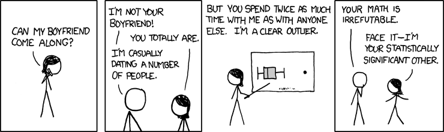
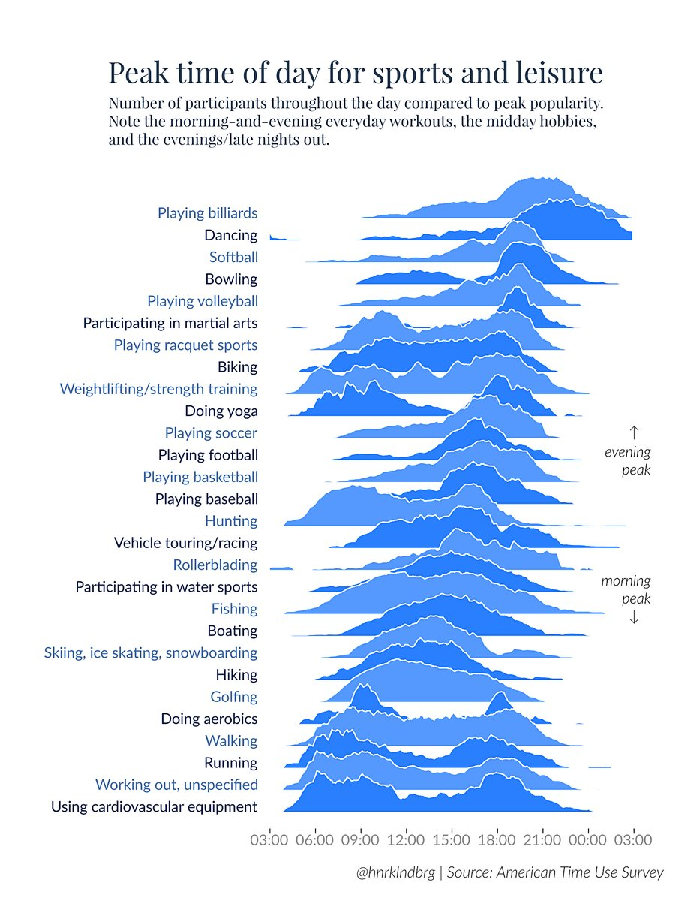
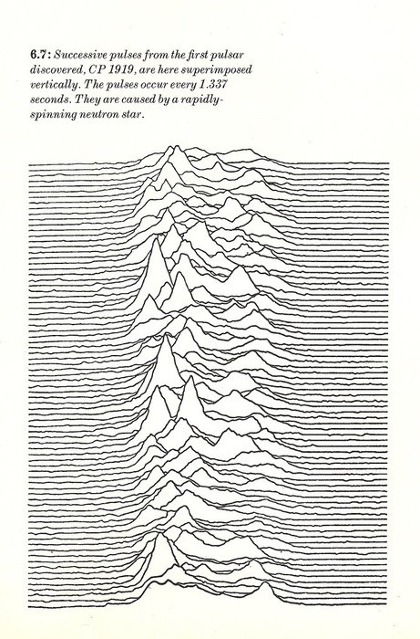

```{r setup, include=FALSE, cache=FALSE}
library(knitr)
options(digits = 3, scipen = 999)
knit_hooks$set(crop = hook_pdfcrop)
opts_chunk$set(fig.align='center', crop=TRUE, 
               cache=TRUE, message = FALSE,
               echo = FALSE, warning = FALSE)
opts_knit$set(global.par = TRUE)
```

# Weekly Savings

```{r}
library(tidyverse)
set.seed(5702)
WeeklySavings <- tibble(A = rexp(n = 52, rate = .015)) %>% 
  mutate(B = rnorm(n = 52, mean = median(A) - 2,
                    sd = 50),
         C = ifelse(test = B > median(B) + 10, 
                     yes = B * 10, no = B),
         D = ifelse(test = B < median(B) - 10,
                     yes = B - 100, no = B)) 
WeeklySavings <- WeeklySavings %>% 
  dplyr::mutate_all(sort)


DT::datatable(WeeklySavings, options = list(paging=F)) %>% DT::formatCurrency(1:4)
```

# Histograms

```{r}
tidySavings <- gather(WeeklySavings, person, amount)
ggplot(tidySavings, aes(amount)) + geom_histogram(fill = "blue") + facet_wrap(~person)
```

# Boxplots

```{r}
boxplot(WeeklySavings, horizontal = TRUE, las = 1)
```


# Boxplot (Person "D")

```{r}
fivenumnames <- c("min", "lower-hinge", "median", "upper-hinge", "max")
D <- WeeklySavings$D
fivenum(D) %>% set_names(fivenumnames)
boxplot(D, horizontal = TRUE, ylim=c(-250, 200))
text(fivenum(D)[c(1,3,5)], 1.25, round(fivenum(D)[c(1,3,5)],1), col = "red")
text(fivenum(D)[c(2,4)], .75, round(fivenum(D),1)[c(2,4)], col = "red")
```

# Boxplot with outliers (Person "C")

```{r}
C <- WeeklySavings$C
fivenum(C) %>% set_names(fivenumnames)
boxplot(C, horizontal = TRUE)
text(median(C), 1.25, round(median(C),1), col = "red")
text(fivenum(C)[c(2,4)], .75, round(fivenum(C),1)[c(2,4)], col = "red")
```


# What does it take to be an outlier?



https://www.explainxkcd.com/wiki/index.php/539:_Boyfriend

# What does it take to be an outlier?

```{r}
df <- read_csv("../data/BoxOfficeMojo2019Jan0406.csv")
df$`Weekend Gross` <- df$`Weekend Gross`/1000000
```

```{r}
b <- boxplot(df$`Weekend Gross`, 
        horizontal = TRUE, axes = F,
        ylim = c(0, 35), lty = "solid", 
        lwd = 2, border = "blue")
mtext("Weekend Box Office Gross, Top 20",
      side = 3, line = -1, cex = 1.5, 
      font = 2)
mtext("Jan 4-6, 2019",
      side = 3, line = -3, cex = 1.2)
mtext("in millions of $", side = 1, 
      line = .5, cex = 1.2)
axis(1, 0:35, labels = NA, line = -2)
axis(1, seq(0, 35, 5), lwd = 2, line = -2)
# Outlier = "Aquaman" $31 million
```

Source: http://www.boxofficemojo.com/weekend/chart/

# What does it take to be an outlier?
```{r}
b <- boxplot(df$`Weekend Gross`, 
        horizontal = TRUE, axes = F,
        ylim = c(0, 35), lty = "solid", 
        lwd = 2, border = "blue")
mtext("Weekend Box Office Gross, Top 20",
      side = 3, line = -1, cex = 1.5, 
      font = 2)
mtext("January 4-6, 2019",
      side = 3, line = -3, cex = 1.2)
mtext("in millions of $", side = 1, 
      line = .5, cex = 1.2)
axis(1, 0:35, labels = NA, line = -2)
axis(1, seq(0, 35, 5), lwd = 2, line = -2)
outliers <- which(df$`Weekend Gross` %in% b$out)
text(b$out, 1.1, df$Title[outliers], col = "red")
# Outlier = "Aquaman" $31 million
```

fences:  

1.5 x hinge spread above upper-hinge

1.5 x hinge spread below lower-hinge

# Fences

```{r}
b <- boxplot(df$`Weekend Gross`, 
        horizontal = TRUE, axes = F,
        lty = "solid", ylim = c(-15, 35), 
        lwd = 2, border = "blue")
f <- fivenum(df$`Weekend Gross`)
fences <- c(f[2],f[4]) + c(-1,1)*1.5*(f[4]-f[2])
abline(v = fences, col = "green", lwd = 2)

```

fences:  

1.5 x hinge spread above upper-hinge

1.5 x hinge spread below lower-hinge


# Not for discrete data

```{r}
library(likert)
data("pisaitems")
p <- pisaitems[1:100, 2:7] %>% 
  dplyr::mutate_all(as.integer) %>% 
  dplyr::filter(complete.cases(.))

boxplot(p, las = 1, main = "PISA data (scale: 1 - 4)",
        border = "blue")
```

Source: R likert::pisaitems dataset

# Ridgeline plot



Source: https://eagereyes.org/blog/2017/joy-plots

Additional resources:

http://blog.revolutionanalytics.com/2017/07/joyplots.html

https://blogs.scientificamerican.com/sa-visual/pop-culture-pulsar-origin-story-of-joy-division-s-unknown-pleasures-album-cover-video/

# Ridgeline plot inspiration

Jocelyn Bell discovers first radio pulsars, 1967



# Ridgeline plot
```{r}
library(ggridges)
world <- read_csv("../data/countries2012.csv")
gr <- ggplot(world, aes(x = GDP, y = reorder(CONTINENT, -GDP,
                                       median))) + 
  geom_density_ridges(fill = "blue", alpha = .5)
gr
```

# Ridgeline plot, change scale
```{r}
ggplot(world, aes(x = GDP, 
                        y = reorder(CONTINENT, -GDP, median))) + 
  geom_density_ridges(fill = "blue", alpha = .5, scale = 1)
```

# Ridgeline vs. boxplot


Source: https://twitter.com/lenkiefer/status/916823350726610946


# `ggridges` package

**CRAN**
https://CRAN.R-project.org/package=ggridges 

**Github**
https://github.com/clauswilke/ggridges

**Package vignette(s)**
https://cran.r-project.org/web/packages/ggridges/vignettes/introduction.html

https://cran.r-project.org/web/packages/ggridges/vignettes/gallery.html

**Package manual**
https://cran.r-project.org/web/packages/ggridges/ggridges.pdf
