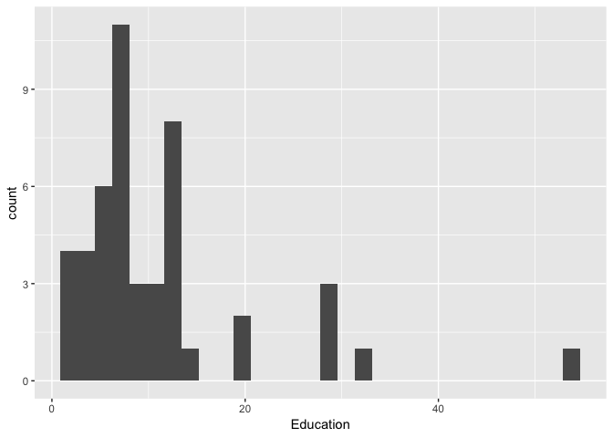
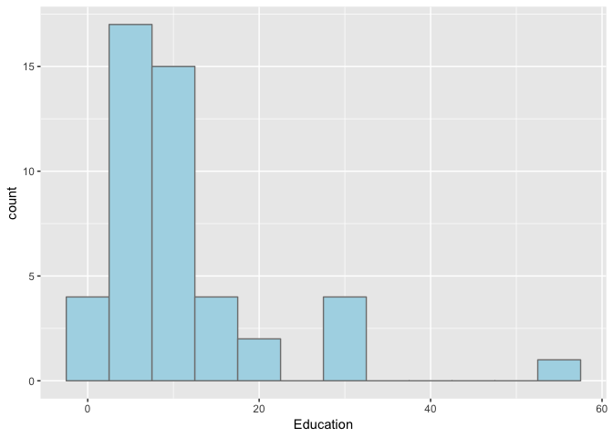
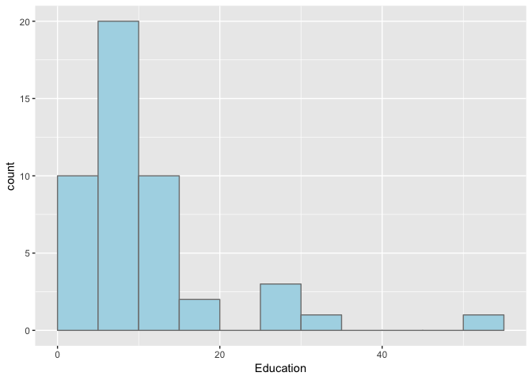
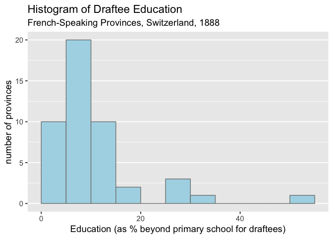
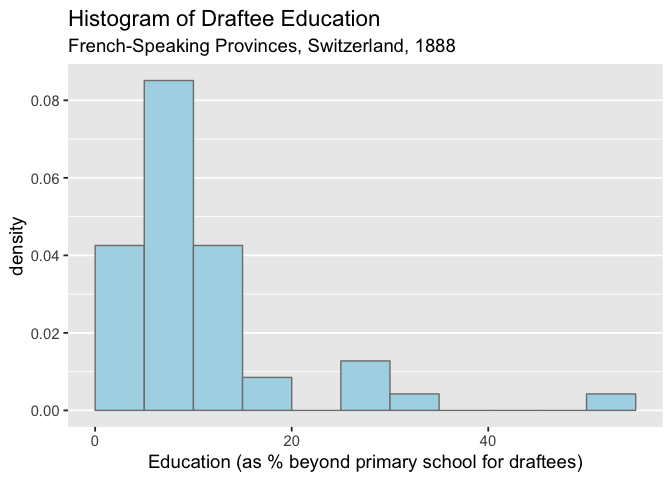
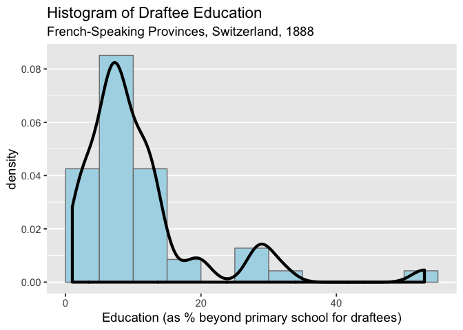
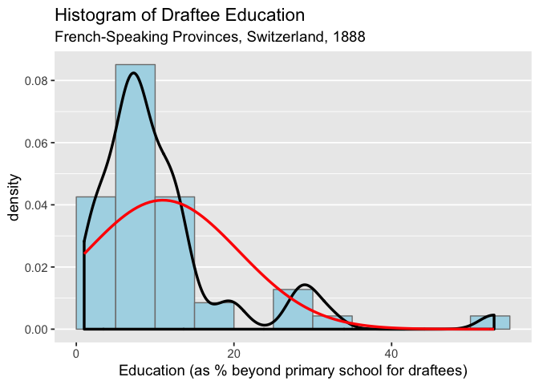
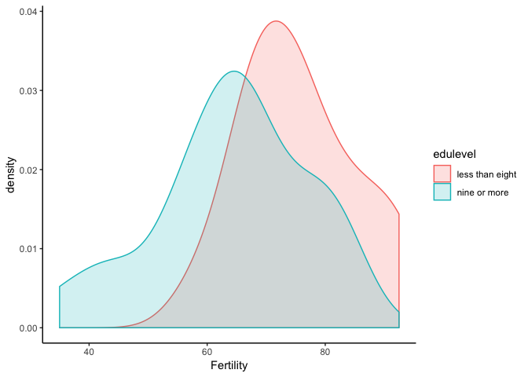
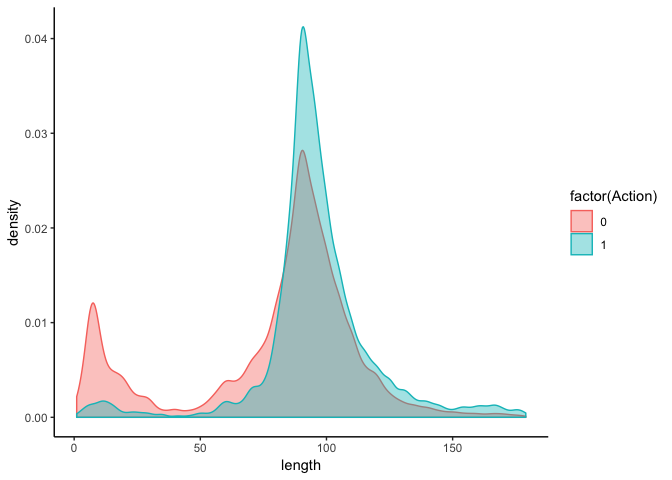

Histogram Solutions
================
January 9, 2019

For help, see `?geom_histogram` and/or

<https://edav.info/histo.html#parameters>

### 1\. Frequency histograms

Choose one of the following datasets:

`swiss` – built-in base R: 47 rows, 6 variables

``` r
str(swiss)
```

    ## 'data.frame':    47 obs. of  6 variables:
    ##  $ Fertility       : num  80.2 83.1 92.5 85.8 76.9 76.1 83.8 92.4 82.4 82.9 ...
    ##  $ Agriculture     : num  17 45.1 39.7 36.5 43.5 35.3 70.2 67.8 53.3 45.2 ...
    ##  $ Examination     : int  15 6 5 12 17 9 16 14 12 16 ...
    ##  $ Education       : int  12 9 5 7 15 7 7 8 7 13 ...
    ##  $ Catholic        : num  9.96 84.84 93.4 33.77 5.16 ...
    ##  $ Infant.Mortality: num  22.2 22.2 20.2 20.3 20.6 26.6 23.6 24.9 21 24.4 ...

`movies` – `ggplot2movies` package: 58788 rows, 24 variables

``` r
# uncomment and run once:
# install.packages("ggplot2movies")
library(ggplot2movies)
str(movies)
```

    ## Classes 'tbl_df', 'tbl' and 'data.frame':    58788 obs. of  24 variables:
    ##  $ title      : chr  "$" "$1000 a Touchdown" "$21 a Day Once a Month" "$40,000" ...
    ##  $ year       : int  1971 1939 1941 1996 1975 2000 2002 2002 1987 1917 ...
    ##  $ length     : int  121 71 7 70 71 91 93 25 97 61 ...
    ##  $ budget     : int  NA NA NA NA NA NA NA NA NA NA ...
    ##  $ rating     : num  6.4 6 8.2 8.2 3.4 4.3 5.3 6.7 6.6 6 ...
    ##  $ votes      : int  348 20 5 6 17 45 200 24 18 51 ...
    ##  $ r1         : num  4.5 0 0 14.5 24.5 4.5 4.5 4.5 4.5 4.5 ...
    ##  $ r2         : num  4.5 14.5 0 0 4.5 4.5 0 4.5 4.5 0 ...
    ##  $ r3         : num  4.5 4.5 0 0 0 4.5 4.5 4.5 4.5 4.5 ...
    ##  $ r4         : num  4.5 24.5 0 0 14.5 14.5 4.5 4.5 0 4.5 ...
    ##  $ r5         : num  14.5 14.5 0 0 14.5 14.5 24.5 4.5 0 4.5 ...
    ##  $ r6         : num  24.5 14.5 24.5 0 4.5 14.5 24.5 14.5 0 44.5 ...
    ##  $ r7         : num  24.5 14.5 0 0 0 4.5 14.5 14.5 34.5 14.5 ...
    ##  $ r8         : num  14.5 4.5 44.5 0 0 4.5 4.5 14.5 14.5 4.5 ...
    ##  $ r9         : num  4.5 4.5 24.5 34.5 0 14.5 4.5 4.5 4.5 4.5 ...
    ##  $ r10        : num  4.5 14.5 24.5 45.5 24.5 14.5 14.5 14.5 24.5 4.5 ...
    ##  $ mpaa       : chr  "" "" "" "" ...
    ##  $ Action     : int  0 0 0 0 0 0 1 0 0 0 ...
    ##  $ Animation  : int  0 0 1 0 0 0 0 0 0 0 ...
    ##  $ Comedy     : int  1 1 0 1 0 0 0 0 0 0 ...
    ##  $ Drama      : int  1 0 0 0 0 1 1 0 1 0 ...
    ##  $ Documentary: int  0 0 0 0 0 0 0 1 0 0 ...
    ##  $ Romance    : int  0 0 0 0 0 0 0 0 0 0 ...
    ##  $ Short      : int  0 0 1 0 0 0 0 1 0 0 ...

Draw histograms of individual variables. Experiment with changing the
bin width and center.

``` r
library(ggplot2)
ggplot(swiss, aes(Education)) + geom_histogram()
```

<!-- -->

``` r
ggplot(swiss, aes(Education)) +
  geom_histogram(color = "grey50",
                 fill = "lightblue",
                 binwidth = 5)
```

<!-- -->

``` r
ggplot(swiss, aes(Education)) +
  geom_histogram(color = "grey50",
                 fill = "lightblue",
                 binwidth = 5,
                 boundary = 0)
```

<!-- -->

### 2\. Add title and axis labels

Choose one graph and add a title and clear x and y axis labels (Use
`?swiss` or `?movies` for more info about the datasets.)

``` r
ggplot(swiss, aes(Education)) +
  geom_histogram(color = "grey50",
                 fill = "lightblue",
                 binwidth = 5,
                 boundary = 0) +
  xlab("Education (as % beyond primary school for draftees)") + ylab("number of provinces") +
  ggtitle("Histogram of Draftee Education", sub =  "French-Speaking Provinces, Switzerland, 1888") +
  theme_grey(14) +
  theme(panel.grid.major.x = element_blank(),
        panel.grid.minor.x = element_blank())
```

<!-- -->

### 3\. Density histograms

Chooose one variable and create a density histogram with
`geom_histogram(aes(y = ..density..))`

``` r
g <- ggplot(swiss, aes(Education)) +
  geom_histogram(aes(y = ..density..),
                 color = "grey50",
                 fill = "lightblue",
                 binwidth = 5,
                 boundary = 0) +
  xlab("Education (as % beyond primary school for draftees)") + 
  ggtitle("Histogram of Draftee Education", sub =  "French-Speaking Provinces, Switzerland, 1888") +
  theme_grey(14) +
  theme(panel.grid.major.x = element_blank(),
        panel.grid.minor.x = element_blank())
g
```

<!-- -->

### 4\. Density curves

Add a density curve with `+
geom_density()`

``` r
g + geom_density(size = 1.5)
```

<!-- -->

### 5\. Normal curve

Challenge: Add a normal distribution curve. (Hint: see
`?stat_function`).

``` r
g + geom_density(size = 1.2) +
  stat_function(fun = dnorm,
                args = list(mean = mean(swiss$Education),
                            sd = sd(swiss$Education)),
                color = "red",
                size = 1.2)
```

<!-- -->

### 6\. Multiple density curves

Demo:

``` r
library(dplyr)
swiss2 <- swiss %>% 
  mutate(edulevel = ifelse(Education < 9, 
                           "less than eight", 
                           "nine or more"))

ggplot(swiss2, aes(x = Fertility, 
                   color = edulevel, 
                   fill = edulevel)) +
  geom_density(alpha = .2) + 
  theme_classic()
```

<!-- -->

Compare density curves for `length` of Action vs. non-Action movies.
(Hint: convert the `Action` column to a factor)

``` r
movies2 <- movies %>% filter(length < 180)

ggplot(movies2, aes(length, 
                   color = factor(Action), 
                   fill = factor(Action))) +
  geom_density(alpha = .4) +
  theme_classic()
```

<!-- -->
