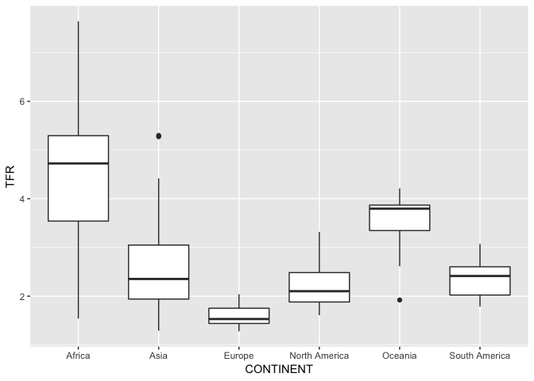

Boxplot Solutions
================
January 9, 2019

For help, see `?boxplot`, `?geom_boxplot` and/or

<https://edav.info/box.html>

Datasets:

`movies` – `ggplot2movies` package: 58788 rows, 24 variables

``` r
# uncomment and run once:
# install.packages("ggplot2movies")
```

Data: `countries2012.csv`

Available in the data folder, direct
link:

<https://github.com/DS-BootCamp-DSI-Columbia/AY2018-2019-Winter-Collaboratory-Faculty/blob/master/Bootcamp-materials/Day1-EDAV-ggplot2/data/countries2012.csv>

## Single boxplots

### 1\. Countries

Draw a boxplot of the `TFR` (total fertility rate) column in the
countries dataset.

``` r
library(tidyverse)
df <- read_csv("../data/countries2012.csv")
boxplot(df$TFR)
```

<!-- -->

### 2\. Movies

Draw a horizontal boxplot of the `length` variable of the `movies`
dataset.

``` r
library(ggplot2movies)
boxplot(movies$length, horizontal = TRUE)
```

<!-- -->

Boxplot of movies under 3 hours:

``` r
library(tidyverse)
movies2 <- movies %>% filter(length < 180)
boxplot(movies2$length, horizontal = TRUE)
```

<!-- -->

(Not very informative…)

## Multiple boxplots

### 3\. Countries

Draw multiple boxplots of `TFR` in the countries dataset by `CONTINENT`.

``` r
ggplot(df, aes(x = CONTINENT,     
                  y = TFR)) + 
  geom_boxplot()
```

<!-- -->

Ordered by median in decreasing order:

``` r
ggplot(df, aes(x = fct_reorder(CONTINENT, -TFR, median),
               y = TFR)) +
  geom_boxplot()
```

<!-- -->

### 4\. Movies

Draw multiple boxplots of `length` in the `movies` dataset by `mpaa`.

``` r
ggplot(movies, aes(mpaa, length)) + 
  geom_boxplot()
```

<!-- -->

### 5\. Filter / subset

Filter / subset the data in the previous question to obtain clearer
views of the trends.

``` r
# remove movies that don't have an MPAA rating
movies2 <- movies %>% filter(mpaa != "")

# use logical order for MPAA levels (move NC-17 to th end)

movies2 <- movies2 %>% 
  mutate(mpaa = fct_relevel(mpaa, "NC-17", after = Inf))

ggplot(movies2, aes(mpaa, length)) + geom_boxplot()
```

<!-- -->
