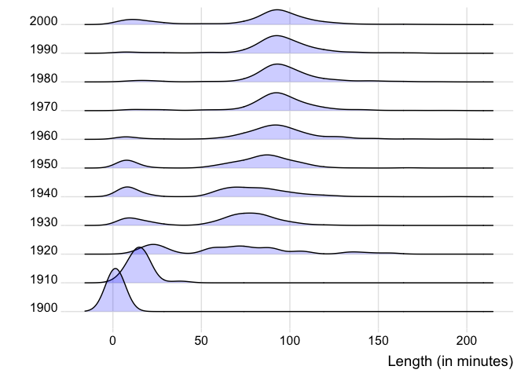

Ridgeline Solutions
================
January 9, 2019

Dataset:

`movies` – `ggplot2movies` package: 58788 rows, 24 variables

Draw ridgeline plots from the `movies` dataset, such as `length` by
`year` (Filter / subset as appropriate).

``` r
# uncomment and run once:
# install.packages("ggplot2movies")
library(ggplot2movies)
```

``` r
library(tidyverse)
library("ggridges")
movies2 <- movies %>% filter(length < 200) %>% 
  filter(year/10 == floor(year/10))

ggplot(movies2, aes(x=length, y=factor(year))) +
  geom_density_ridges(scale = 1.5, 
                      fill = "blue",
                      alpha = .2) +
  xlab("Length (in minutes)") + 
  ylab("") +
  theme_ridges() 
```

<!-- -->
