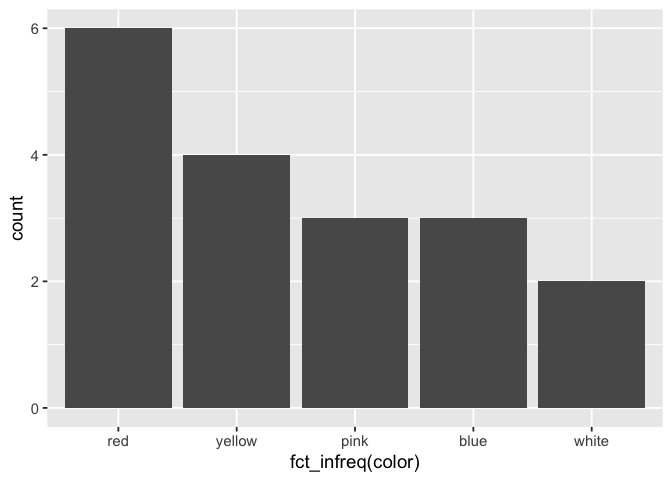
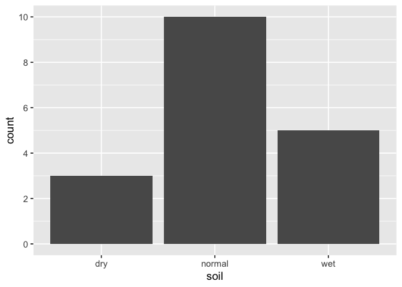

Barchart Solutions
================
January 9, 2019

### 1\. Recoding

Data: `flower` dataset in **cluster** package

Rename the column names and recode the levels of categorical variables
to descriptive names. For example, “V1” should be renamed “winters” and
the levels to “no” or “yes”. Display the full dataset.

Help: `?fct_recode`

``` r
library(cluster)
library(tidyverse)
f <- flower %>% 
  transmute(winter = fct_recode(V1, no = "0", yes = "1"),
  shadow = fct_recode(V2, no = "0", yes = "1"),
  tubers = fct_recode(V3, no = "0", yes = "1"),
  color = fct_recode(V4, white = "1", yellow = "2", pink = "3", red = "4", blue = "5"),
  soil = fct_recode(V5, dry = "1", normal = "2", wet = "3"),
  ranking = V6,
  height = V7,
  distance = V8)
f
```

    ##    winter shadow tubers  color   soil ranking height distance
    ## 1      no    yes    yes    red    wet      15     25       15
    ## 2     yes     no     no yellow    dry       3    150       50
    ## 3      no    yes     no   pink    wet       1    150       50
    ## 4      no     no    yes    red normal      16    125       50
    ## 5      no    yes     no   blue normal       2     20       15
    ## 6      no    yes     no    red    wet      12     50       40
    ## 7      no     no     no    red    wet      13     40       20
    ## 8      no     no    yes yellow normal       7    100       15
    ## 9     yes    yes     no   pink    dry       4     25       15
    ## 10    yes    yes     no   blue normal      14    100       60
    ## 11    yes    yes    yes   blue    wet       8     45       10
    ## 12    yes    yes    yes  white normal       9     90       25
    ## 13    yes    yes     no  white normal       6     20       10
    ## 14    yes    yes    yes    red normal      11     80       30
    ## 15    yes     no     no   pink normal      10     40       20
    ## 16    yes     no     no    red normal      18    200       60
    ## 17    yes     no     no yellow normal      17    150       60
    ## 18     no     no    yes yellow    dry       5     25       10

### 2\. Barcharts

Create frequency bar charts for the `color` and `soil` variables, using
best practices for the order of the bars.

Help:

<https://github.com/jtr13/codehelp/blob/master/R/reorder.md>

``` r
ggplot(f, aes(fct_infreq(color))) + geom_bar() + theme_grey(14)
```

<!-- -->

``` r
ggplot(f, aes(soil)) + 
  geom_bar() +
  scale_y_continuous(breaks = seq(0,10,2)) + theme_grey(14)
```

<!-- -->
