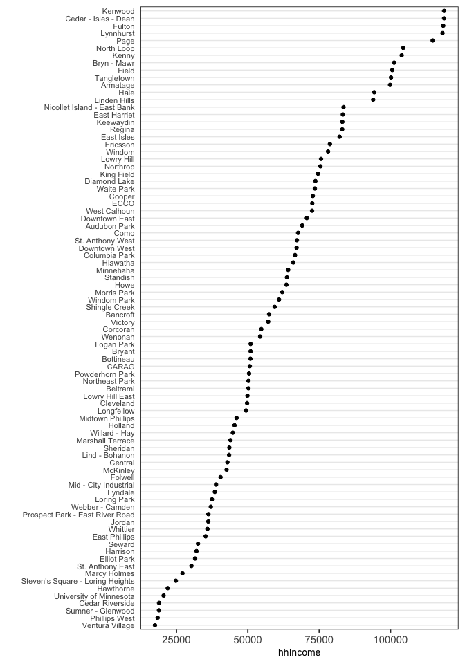
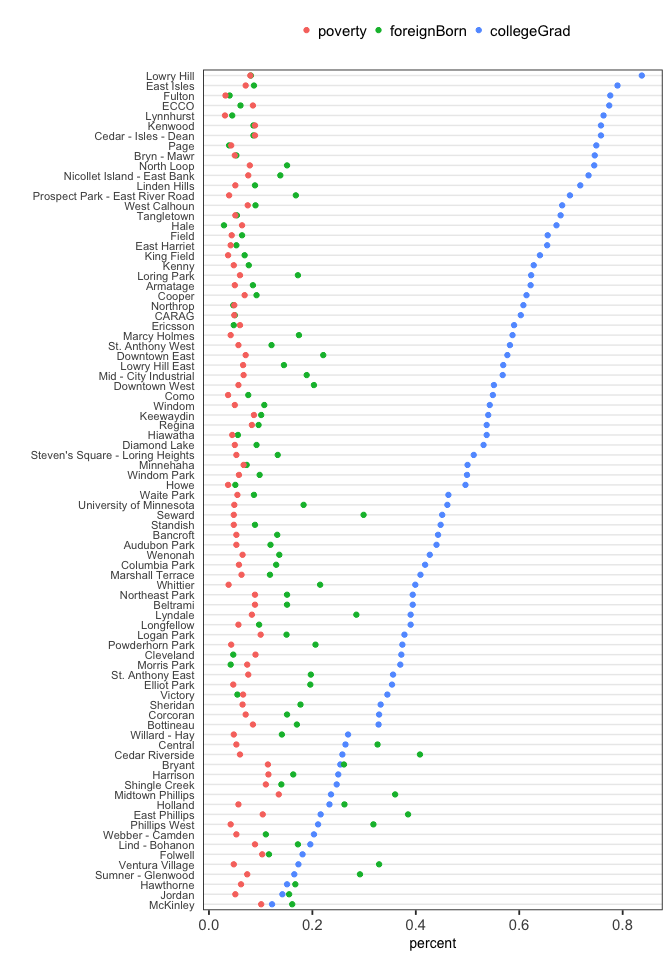

Cleveland Dot Plots
================
January 9, 2019

Data: `MplsDemo` in **carData** package

### 1\. Single dot plot

Create a Cleveland dot plot showing estimated median household income by
neighborhood.

``` r
library(carData)
library(tidyverse)
theme_dotplot <- theme_bw(14) +
    theme(axis.text.y = element_text(size = rel(.75)),
          axis.ticks.y = element_blank(),
          axis.title.x = element_text(size = rel(.75)),
          panel.grid.major.x = element_blank(),
          panel.grid.major.y = element_line(size = 0.5),
          panel.grid.minor.x = element_blank())
```

``` r
mtidy <-  MplsDemo %>%
  select(neighborhood, collegeGrad, foreignBorn, poverty) %>% 
  gather(key = variable, value = percent, -neighborhood) %>% 
  mutate(variable = factor(variable, levels = c("poverty", "foreignBorn", "collegeGrad")))

ggplot(MplsDemo, aes(hhIncome, fct_reorder(neighborhood, hhIncome))) +
  geom_point() + ylab("") +
  theme_dotplot + theme(legend.position = "top")
```

<!-- -->

### 2\. Multiple dot plot

Use a Cleveland dot plot with multiple dots per row to show percentage
of foreign born, earning less than twice the poverty level, and with a
college degree in different colors. Data should be sorted by college
degree.

``` r
mtidy <-  MplsDemo %>%
  select(neighborhood, collegeGrad, foreignBorn, poverty) %>% 
  gather(key = variable, value = percent, -neighborhood) %>% 
  # factor levels are changed so order of levels in the legend is the same as in the graph
  mutate(variable = factor(variable, levels = c("poverty", "foreignBorn", "collegeGrad")))

ggplot(mtidy, aes(percent, fct_reorder2(neighborhood, variable, -percent),
                  color = variable)) +
  geom_point() + ylab("") +
  theme_dotplot + theme(legend.position = "top",
                        legend.title = element_blank())
```

<!-- -->

### 3\. Interpretation

What patterns do you observe? What neighborhoods do not appear to follow
these patterns?

`collegeGrad` has the widest spread. It appears to be negatively
correlated with `foreignBorn`. `poverty` is (surprisingly?) steady more
or less across neighborhoods, and not correlated with `collegeGrad`.
`Seward` has a rate of `foreignBorn` given its percentage of
`collegeGrad`. (Other outliers can be observed as well.)
