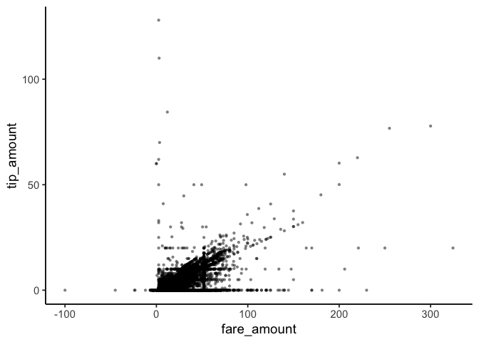
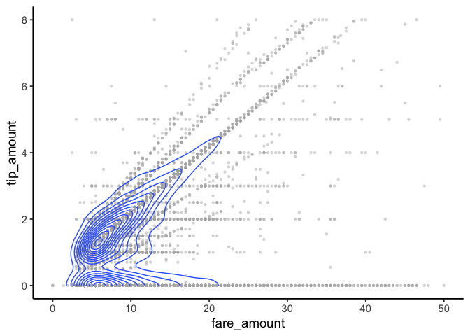
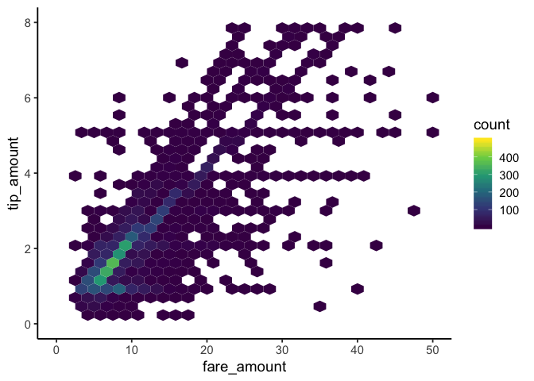
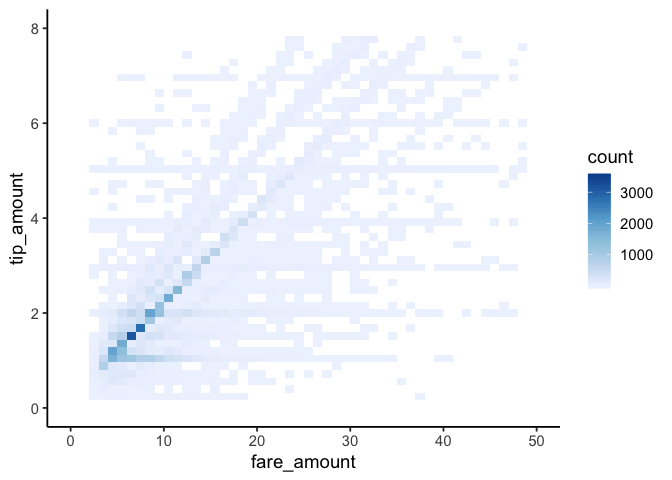
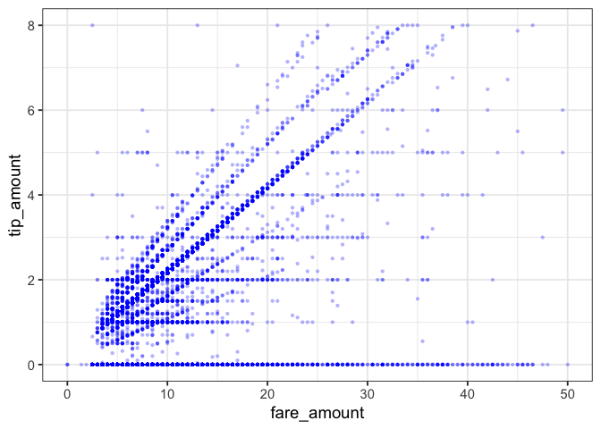

Scatterplots Solutions
================
January 9, 2019

### Taxis

Data: NYC yellow cab rides in June 2018, available here:
<http://www.nyc.gov/html/tlc/html/about/trip_record_data.shtml>

It’s a large file so work with a random subset of the data.

Draw four scatterplots of `tip_amount` vs. `far_amount` with the
following
variations:

### 1\. Points with alpha blending

``` r
# Read in the large dataset once only, subset, and write to file to save time:

df <- read_csv("~/Downloads/yellow_tripdata_2018-06.csv")
set.seed(5702)
taxis <- df[sample(100000),]
write_csv(taxis, "taxidata.csv")
```

``` r
library(tidyverse)
df <- read_csv("../data/taxidata.csv")
ggplot(df, aes(fare_amount, tip_amount)) +
  geom_point(alpha = .5, stroke = 0) +
  theme_classic(14)
```

<!-- -->

### 2\. Points with alpha blending + density estimate contour lines

For a better view, we will remove the negative fare values as well as
some of the outliers. In addition, we’ll reduce the number of points to
reduce overplotting:

``` r
set.seed(5702)
index <- sample(nrow(df), 10000)
df2 <- df[index,] 
ggplot(df2, aes(fare_amount, tip_amount)) +
  geom_point(alpha = .5, stroke = 0, color = "grey70") + geom_density_2d() +
  scale_x_continuous(limits = c(0, 50)) +
  scale_y_continuous(limits = c(0, 8)) +
  theme_classic(14)
```

<!-- -->

### 3\. Hexagonal heatmap of bin counts

``` r
ggplot(df2, aes(fare_amount, tip_amount)) +
  geom_hex() +
  scale_x_continuous(limits = c(0, 50)) +
  scale_y_continuous(limits = c(0, 8)) +
  scale_fill_viridis_c() +
  theme_classic(14)
```

<!-- -->

### 4\. Square heatmap of bin counts

``` r
ggplot(df, aes(fare_amount, tip_amount)) +
  geom_bin2d(bins = 50) +
  scale_fill_distiller(palette = "Blues",
                       direction = 1) +
  scale_x_continuous(limits = c(0, 50)) +
  scale_y_continuous(limits = c(0, 8)) +
  theme_classic(14)
```

<!-- -->

For all, adjust parameters to the levels that provide the best views of
the data.

### 5\. Describe noteworthy features of the data.

For this particular dataset, a scatterplot of a random sample of the
data has many advantages over the other forms. In many cases, contour
lines or binning help identify clusters. But in this unusual case, the
most interesting feature is the collection of straight lines that cross
through the data at different angles. When we bin the data, or draw
contour lines, this feature becomes much less prominent.

Let’s look again at the scatterplot:

``` r
g <- ggplot(df2, aes(fare_amount, tip_amount)) +
  geom_point(alpha = .3, stroke = 0, color = "blue") +
  scale_x_continuous(limits = c(0, 50)) +
  scale_y_continuous(limits = c(0, 8)) +
  theme_bw(14)
g
```

<!-- -->

We note the following:

1.  There are large number of people who don’t tip at all, even for high
    fare amounts.

2.  Prominent horizontal lines indicate that quite a few people tip even
    dollar amounts up to $5. There is a mild association with fare
    amount – for example, more $5 tips than $2 tips for high fares.
    However there is quite a wide range of fare amounts for which people
    give fixed even dollar tip amounts.

3.  The straight diagonal lines are particularly interesting. They
    indicate a linear relation between fare and tip amounts, which is
    very likely due to the option when paying with a credit card to tip
    a percentage of the total. Tip choices are generally multiples of
    5%.

4.  With the exception of the $0 tips, and some $1 and $2 tips, the vast
    majority of tips are within these lines, forming a cone shape of
    tips.

5.  Although the straight lines are fairly close to the patterns in the
    plotted points, there are some deviations. First we note that most
    of the points are above the lines, suggesting that the tips are
    slightly higher than the indicated tip percenages.

6.  We also notice that there’s an unusual fork in one of the lines
    around ($23, $6). Moving up and the right from this point, there are
    two straight lines, one with a smaller slope than the other.

7.  The data appear to be rounded, more so for the fare amount than the
    tip amount. (For example, on the horiztonal line where the tip is
    zero, the fare amounts do not overlap, but on the vertical line
    where the fare is $5, the points do overlap significantly.)

8.  There are a few outliers, high tips for low fares, and low tips for
    high fares.
