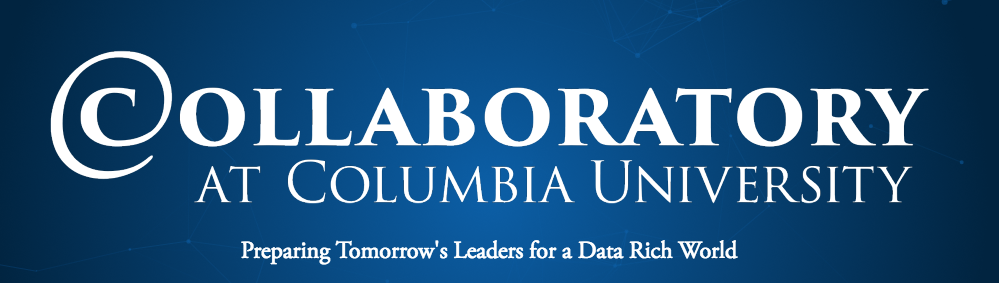

[**[Direct ENTER bootcamp materials]**](/Bootcamp-materials/Course-Info.md)

<b> <H1 align="center"> 3rd Annual Data Science Boot Camp </H1> </b>

 

### The Columbia [Data Science Institute](http://datascience.columbia.edu/) and [Columbia Enterpreneuship](http://entrepreneurship.columbia.edu/) are organizing the Third Winter-Intensive Data Science Boot Camp

- **When**: 
	- Data Science Skill Camp: January 9th – 11th, 2019
	- Data Science Research Intensive Camp: January 14th-15th, 2019
- **Where**: TBD

[comment]: # (Columbia Entrepreneurship Design Studio, Room 430 of the Riverside # Church (490 Riverside Dr, New York, NY 10027) )

- **Daily schedule**: 10am to 4pm (*9am to 10am, Boot camp introduction on Wednesday, January 9th and Monday, January 14th)
- **Who should apply**: Columbia full-time faculty, postdoctoral researchers and senior Ph.D. students who have working knowledge of programming and data analytics and are ready to sharpen their skills to include a training in data science skills, and/or to initiate a project in data science. **Seats are limited**, and we will give **priority** to full-time tenure-track/tenured faculty from non-quantitative fields.

The [Collaboratory@Columbia](http://collaboratory.columbia.edu/) is pleased to announce our third annual free **Winter-Break Data Science Boot Camp**.  Designed by faculty and postdoctoral scholars from Columbia University’s [Data Science Institute](http://datascience.columbia.edu/), the curriculum includes on-line learning material, introductory lectures, hands-on laboratory experiences and a capstone project.

This year, the boot camp's mission is to enable Columbia faculty members, postdoctoral researchers and senior Ph.D. students to adopt more state-of-the-art data-science tools in their research and educational activities. To achieve this goal, we have designed a 3+2 model that is different from the previous week-long format. The first three days (January 9th-11th) will be a *data science skill camp* that consists of three one-day long courses taught by DSI core curriculum's instructors on *exploratory data analysis and visualization*, *statistical modeling* and *machine learning*. On January 14th and 15th, we will have a two-day "research hackathon" where faculty will work with data science students on a short research project from their field. During this two-day *data science research camp*, faculty participants will explore a potential data-driven research idea, gain first-hand experience on working with data science students, and map out the required data-science workflow for the proposed idea, while supported by the boot camp instructors. Participants, working with their student team members, will also be encouraged to create data science teaching modules based on their project. 

- Click [here](https://github.com/DS-BootCamp-Collaboratory-Columbia/AY2017-2018-Winter/blob/master/Bootcamp-materials/Course-Info.md) to **START** (detailed course information and setup instructions.)

### About the instructors

  

**[Andreas Mueller](http://amueller.github.io/)** ([@amueller](https://github.com/amueller)) is a lecturer at the [Data Science Institute](http://datascience.columbia.edu/)at Columbia University and author of the O’Reilly book “[Introduction to Machine Learning with Python](http://amueller.github.io/#book)”, describing a practical approach to machine learning with python and scikit-learn. He is one of the core developers of the scikit-learn machine learning library, and he has been co-maintaining it for several years. He is also a [Software Carpentry](http://software-carpentry.org/) instructor. In the past, he worked at the NYU Center for Data Science on open source and open science, and as Machine Learning Scientist at Amazon. You can find his full  cv [here](http://amueller.github.io/cv_andreas_mueller.pdf). His mission is to create open tools to lower the barrier of entry for machine learning applications, promote reproducible science and democratize the access to high-quality machine learning algorithms.

**[Tian Zheng](http://www.stat.columbia.edu/~tzheng/)** ([@tz33cu](https://github.com/tz33cu)) is Professor of Statistics, Associate Director for Education of Data Science Institute at Columbia University. She develops novel methods for exploring and understanding patterns in complex data from different application domains such as biology, psychology, climatology, and etc. Her current projects are in the fields of statistical machine learning, spatiotemporal modeling and social network analysis. Professor Zheng’s research has been recognized by the 2008 Outstanding Statistical Application Award from the American Statistical Association (ASA), the Mitchell Prize from ISBA and a Google research award. She became a Fellow of American Statistical Association in 2014. Professor Zheng is the receipt of 2017 Columbia’s Presidential Award for Outstanding Teaching. In 2018, she will be the chair-elect for ASA’s section on Statistical Learning and Data Science. She is on the advisory board for STATS at Sense About Science America that targets to develop a statistical literate citizenry.

### About [Collaboratory@Columbia](http://collaboratory.columbia.edu/)
Jointly founded by Columbia University’s [Data Science Institute](http://datascience.columbia.edu/) and [Columbia Entrepreneurship](http://entrepreneurship.columbia.edu/), The [Collaboratory@Columbia](http://collaboratory.columbia.edu/) is a university-wide program dedicated to supporting collaborative curricula innovations designed to ensure that all Columbia University students receive the education and training that they need to succeed in today’s data rich world.

